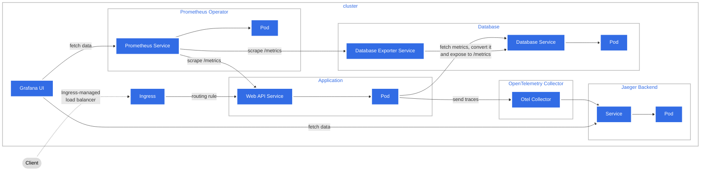

[](https://github.com/rust-secure-code/safety-dance/)

# Web API to demonstrate axum capabilities

[Axum](https://github.com/tokio-rs/axum) is a web framework that is supported by the tokio team. It integrate natively with the tower and tower-http ecosystem, so we can use middleware, services, and utilities with axum. Moreover, we can also use this with other framework that work with tower like hyper for http and tonic for grpc.

The internal logic is intentionally keep simple. This allow to focus on the overwall logic of the Axum framework, it's observability and the deployment part. As this app is a demo, the goal is to be compliant against the most web API standards.

The infrastructure folder contain code to be able to run the applications in differentes environnements : [Docker Compose](https://docs.docker.com/compose/), [Cloud Run](https://cloud.google.com/run) et [Kubernetes](https://kubernetes.io).

## Kubernetes Architecture

The observability architecture is based on the official [exemple](https://opentelemetry.io/docs/demo/architecture/) of the opentelemetry website exept that we are not using the prometheus pushgateway but the pull mechanisme.

The architecture is using kubernetes to simulate a production environmment using [minikube](https://minikube.sigs.k8s.io/docs/start/).



The prometheus operator is used to monitor kubernetes API, the postgres instance and the web application. The database is generally hosted outside of the kubernetes cluster but for the sake of the demonstration, we will deploy it inside the cluster. To add a new target to prometheus, we juste have to create a CRD of type ServiceMonitor and add the label:
release: prometheus.

The opentelemetry operator give use new CRD for opentelmetry collectors with differents deployments modes(deployment, statefulset, daemonset, sidecar). Here we use the daemonset mode to be sure that one pod is available on all nodes. The collector is able to receive data from different sources, here we send it via grpc on the port 4317 on the collector. It then process data to add kubernetes metadata for all traces it receive to enriche the information of the traces and add more contexte.

All of the traces are then exported to a backend : jaeger. All the traces will be store here and we can view it with the jaeger UI. There are also backends type for cloud integrations like cloud trace for GCP or AWS X-Ray. A full list of the available exporters can be found [here](https://opentelemetry.io/ecosystem/registry/?component=exporter)

## Exemple of a trace view in jaeger UI :


We have the information from the application like the http route, thread.
And the infrastructure information added by the otel collector like the kubernetes namespace, pod name, pod creation.
With that, we can correlate application traces with prometeuses metrics from kubernetes.

## Features

- [RFC 7807](https://datatracker.ietf.org/doc/html/rfc7807) compliant for all error message
- [OpenAPI](https://www.openapis.org) docs
- Traces export to an otel backend in the [otlp](https://opentelemetry.io) format
- Graceful Shutdown for sending last traces before the application stop
- Expose metrics in the [prometheus](https://prometheus.io) format at /metrics
- Visualize data with [grafana](https://grafana.com)
- Timout
- Rate Limiting
- Serve static file
- Helth check routes
- Rest Routes
- Auth with cookies and jwt

## To Do

- All the list of TODO can be found [here](https://github.com/users/aimericsr/projects/1)
- fix db related test
- load env variable only at the beginning ?
- version the api (path or url ?)
- handle db connection retry system
- handle request body validation with custom messages
- Infra : Deployments strategies and upgrade helm charts ?
- Grpc routes
- GraphQL routes

## Prerequesite

- [Rust](https://www.rust-lang.org/tools/install)
- [Docker](https://docs.docker.com/engine/install/)(also install Docker compose)
- [Minikube](https://minikube.sigs.k8s.io/docs/start/) (also install kubectl)
- [Helm](https://helm.sh/docs/intro/install/)
- [k6](https://k6.io/docs/get-started/installation/)
- [cmctl](https://cert-manager.io/docs/reference/cmctl/#installation)

## Starting the needed services

```sh
docker compose --profile app up -d
```

## Run Uni Test / Integration Test and Doc Test

```sh
cargo test -- --nocapture
```

## Opening the docs

```sh
cargo doc --document-private-items --open
```

## Manage Different Rust Versions

```sh
rustup help toolchain
rustup install nightly
rustup default nightly-aarch64-apple-darwin
rustup update
rustc --version
```

## Project Conventions

function test name : test*[function_name]*[ok/err]\_[case_tested]

## License

This project is licensed under the [Apache License](LICENSE).

## Rust

```sh
brew install openssl@1.1
cargo install cargo-edit
cargo install cargo-expand
cargo install --version=0.7.2 sqlx-cli --no-default-features --features postgres
```

## Run load

```sh
docker-compose --profile load-test run k6 run -o experimental-prometheus-rw /scripts/script.js
```

## Minikube

```sh
minikube addons enable dashboard
minikube addons enable metrics-server
minikube addons enable ingress
minikube start --memory 4096 --cpus 4
minikube tunnel
```

To use Ingress on local with a host add the following line to your /etc/hosts file: <br> 127.0.0.1 host-name-you-want

## Lunch k8 cluster

```sh
kubectl apply -f external-services/kubernetes/app/namespaces/dev.yaml
kubectl config set-context minikube --namespace=dev

# Helm : add needed repositories
helm repo add prometheus-community https://prometheus-community.github.io/helm-charts
helm repo add jetstack https://charts.jetstack.io
helm repo add open-telemetry https://open-telemetry.github.io/opentelemetry-helm-charts

# Install Prometheus to scrape kubernetes engine metrics, install also Grafana with build-in dashboard
helm install prometheus prometheus-community/kube-prometheus-stack --version "51.2.0" \
     -f external-services/kubernetes/helm/kube-prometheus-stack/values.yaml \
     --namespace=dev

# Create postgres exporter to be able to monitor with prometheus
helm install postgres-exporter prometheus-community/prometheus-postgres-exporter --version "5.1.0" \
    -f external-services/kubernetes/helm/prometheus-postgres-exporter/values.yaml \
     --namespace=dev

# Install Cert manager
helm install \
  cert-manager jetstack/cert-manager \
  --namespace cert-manager \
  --create-namespace \
  --version v1.13.1 \
  --set installCRDs=true

# Test the install of cert manager
cmctl check api --wait=2m

# Install the opentelemetry Operator, this automatically generate a self-signed cert and a secret for the webhook
helm install my-opentelemetry-operator open-telemetry/opentelemetry-operator --version 0.39.1 \
    -f external-services/kubernetes/helm/opentelemetry-operator/values.yaml

# Create custom CRD for otlp collectors
kubectl apply -f external-services/kubernetes/app/rbac/otel-dev.yaml
kubectl apply -R -f external-services/kubernetes/app/opentelemetrycollectors

# Create the ressources for our applications
kubectl apply -R -f external-services/kubernetes/app/configmaps
kubectl apply -R -f external-services/kubernetes/app/secrets
kubectl apply -R -f external-services/kubernetes/app/services
kubectl apply -R -f external-services/kubernetes/app/statefulsets
kubectl apply -R -f external-services/kubernetes/app/deployments
kubectl apply -R -f external-services/kubernetes/app/ingresses

# Create Service account
kubectl apply -f external-services/kubernetes/app/rbac/github-ci.yaml
kubectl config get-contexts
kubectl create token github-ci -n development
kubectl config set-credentials sa-user --token=$TOKEN
kubectl config set-context sa-context --user=sa-user
kubectl config use-context sa-context
```
