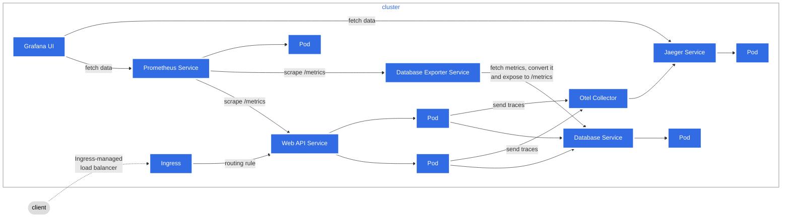
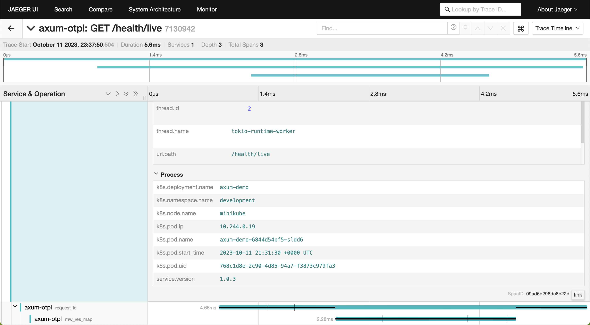

# Web API to demonstrate axum-web capabilities

The internal logic is intentionally keep simple. This allow to focus on the overwall logic of the Axum framework, it's observability and the deployment part.

The observability architecture is based on the official [exemple](https://opentelemetry.io/docs/demo/architecture/) of the opentelemetry website, export of traces to jaeger(or other otlp compatible collector) and /metrics exposed to be scraped by prometheus.

## Architecture



## Exemple of a trace view in jaeger UI : 



We have the information from the application like the http route, thread.
And the infrastructure information added by the otel collector like the kubernetes namespace, pod name, pod creation.
With that, he can correlate application traces with prometeuses metrics from kubernetes.

## Prerequesite

- [Rust](https://www.rust-lang.org/tools/install)
- [Docker](https://docs.docker.com/engine/install/)(also install Docker compose)
- [Minikube](https://minikube.sigs.k8s.io/docs/start/) (also install kubectl)
- [Helm](https://helm.sh/docs/intro/install/)
- [k6](https://k6.io/docs/get-started/installation/)
- [cmctl](https://cert-manager.io/docs/reference/cmctl/#installation)

## Starting the needed services

```sh
docker compose --profile app up -d
```

## Unit Test

```sh
cargo test -- --nocapture crypt
```

## Opening the docs

```sh
cargo doc --document-private-items --open
```

## Manage Different Rust Versions

```sh
rustup help toolchain
rustup install nightly
rustup default nightly-aarch64-apple-darwin
rustup update
rustc --version
```

## Project Conventions

function test name : test*[function_name]*[ok/err]\_[case_tested]

## Features

- Timout
- CORS
- Serve static file
- Helth check routes
- Rest Routes
- RPC Routes
- OpenAPI docs
- Auth with cookies and jwt
- Tracing / metrics export to jeager / - prometheus
- Visualize data with grafana
- Graceful Shutdown for sending last traces

## To Do

- add more filter to tracing
- add more unit test / do integration test
- load env variable only at the beginning
- version the api (path or url ?)
- handle db connection retry system
- handle request body validation
- Grpc routes
- GraphQL routes

## License

This project is licensed under the [Apache License](LICENSE).

## Rust

```sh
brew install openssl@1.1
cargo install cargo-edit
cargo install cargo-expand
cargo install --version=0.7.2 sqlx-cli --no-default-features --features postgres
```

## Run load

```sh
docker-compose --profile load-test run k6 run -o experimental-prometheus-rw /scripts/script.js
```

## Minikube

```sh
minikube addons enable dashboard
minikube addons enable metrics-server
minikube addons enable ingress
minikube start
minikube start --memory 4096 --cpus 4
minikube tunnel
```

To use Ingress on local with a host add the following line to your /etc/hosts file: 127.0.0.1 <host-name>

## Lunch k8 cluster

```sh
kubectl apply -f external-services/kubernetes/app/namespaces/development.yaml
kubectl config set-context minikube --namespace=development

# Helm : add needed repositories
helm repo add prometheus-community https://prometheus-community.github.io/helm-charts
helm repo add jetstack https://charts.jetstack.io
helm repo add open-telemetry https://open-telemetry.github.io/opentelemetry-helm-charts

# Install Prometheus to scrape kubernetes engine metrics, install also Grafana with build-in dashboard
helm install prometheus prometheus-community/kube-prometheus-stack --version "51.2.0" \
     -f external-services/kubernetes/helm/kube-prometheus-stack/values.yaml \
     --namespace=development

# Create custom CRD for monitoring our applications
kubectl apply -R -f external-services/kubernetes/app/servicemonitor

# Create postgres exporter to be able to monitor with prometheus
helm install postgres-exporter prometheus-community/prometheus-postgres-exporter --version "5.1.0" \
    -f external-services/kubernetes/helm/prometheus-postgres-exporter/values.yaml \
     --namespace=development

# Install Cert manager
helm install \
  cert-manager jetstack/cert-manager \
  --namespace cert-manager \
  --create-namespace \
  --version v1.13.1 \
  --set installCRDs=true

# Test the install of cert manager
cmctl check api --wait=2m

# Install the opentelemetry Operator, this automatically generate a self-signed cert and a secret for the webhook
helm install my-opentelemetry-operator open-telemetry/opentelemetry-operator --version 0.39.1 \
    -f external-services/kubernetes/helm/opentelemetry-operator/values.yaml

# Create custom CRD for otlp collectors
kubectl apply -f external-services/kubernetes/app/rbac/otel-dev.yaml
kubectl apply -R -f external-services/kubernetes/app/opentelemetrycollectors

# Create the ressources for our applications
kubectl apply -R -f external-services/kubernetes/app/configmaps
kubectl apply -R -f external-services/kubernetes/app/secrets
kubectl apply -R -f external-services/kubernetes/app/services
kubectl apply -R -f external-services/kubernetes/app/statefulsets
kubectl apply -R -f external-services/kubernetes/app/deployments
kubectl apply -R -f external-services/kubernetes/app/ingresses

# Create Service account
kubectl apply -f external-services/kubernetes/app/rbac/github-ci.yaml
kubectl config get-contexts
kubectl create token github-ci -n development
kubectl config set-credentials sa-user --token=$TOKEN
kubectl config set-context sa-context --user=sa-user
kubectl config use-context sa-context
```
