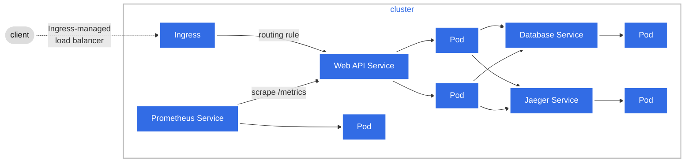

# AwesomeApp rust-web-app


## Web API to demonstrate axum-web capabilities

The internal logic is intentionally keep simple. This allow to focus on the overwall logic of the Axum framework, it's observability and the deployment part.

The observability architecture is based on the official [exemple](https://opentelemetry.io/docs/demo/architecture/) of the opentelemetry website, export of traces to jaeger(or other otlp compatible collector) and /metrics exposed to be scraped by prometheus.

## Architecture 




## Prerequesite
- [Rust](https://www.rust-lang.org/tools/install)
- [Docker](https://docs.docker.com/engine/install/)(also install Docker compose)
- [Minikube](https://minikube.sigs.k8s.io/docs/start/) (also install kubectl)
- [Helm](https://helm.sh/docs/intro/install/)
- [k6](https://k6.io/docs/get-started/installation/)


## Starting the needed services

```sh
docker compose --profile app up -d
```

## Unit Test

```sh
cargo test -- --nocapture crypt
```

## Manage Different Rust Versions

```sh
rustup help toolchain
rustup install nightly
rustup default nightly-aarch64-apple-darwin
rustup update
rustc --version
```

## Project Conventions

function test name : test*[function_name]*[ok/err]\_[case_tested]

## Features

- Timout
- CORS
- Serve static file 
- Helth check routes
- Rest Routes
- RPC Routes
- OpenAPI docs
- Auth with cookies and jwt
- Tracing / metrics export to jeager / - prometheus
- Visualize data with grafana
- Graceful Shutdown for sending last traces

## To Do

- add more filter to tracing
- add more unit test / do integration test
- load env variable only at the beginning
- version the api (path or url ?)
- handle db connection retry system
- handle request body validation
- Grpc routes
- GraphQL routes

## License

This project is licensed under the [Apache License](LICENSE).

## Rust 

```sh
brew install openssl@1.1
cargo install cargo-edit
cargo install cargo-expand
cargo install --version=0.7.2 sqlx-cli --no-default-features --features postgres 
```


## Run load

```sh
docker-compose --profile load-test run k6 run -o experimental-prometheus-rw /scripts/script.js
```

## Minikube

```sh
minikube addons enable dashboard
minikube addons enable metrics-server  
minikube addons enable ingress
minikube start
kubectl config set-context minikube --namespace=development
minikube tunnel
```

To use Ingress on local with a host add the following line to your /etc/hosts file: 127.0.0.1 <host-name> 

## Helm

```sh
helm repo add prometheus-community https://prometheus-community.github.io/helm-charts
helm search repo prometheus-community/kube-prometheus-stack --versions

helm install prometheus prometheus-community/kube-prometheus-stack --version "51.2.0"
helm install postgres-exporter prometheus-community/prometheus-postgres-exporter --version "5.1.0" \
    -f kubernetes/app/statefulsets/values.yaml   
```


