# Here is a doc about some useful cargo command and further explications about how the rust compiler(rustc) works. 

## Rustc architecture

```mermaid
graph TD
  subgraph rustc
  invocation[Invocation] -->|raw bytes| lexing
  subgraph frontend
  lexing[Lexing] -->|create token: if,else, variable name ...| parsing
  parsing[Parsing] --> |create an Abstract Syntax Three to represent the relation between all the parts of the code| hir_lowering
  hir_lowering[High-Level Intermediate Representation Lowering : HIR] --> |desugaring : for loop, async fn ...<br> type inference, trait solving and type checking| mir_lowering
  end
  subgraph backend[backend : LLVM]
  mir_lowering[Mid-Level Intermediate Representation Lowering : MIR] --> |borrow checker, monomorphized <br>build .ll files| llvm_ir
  llvm_ir[LLVM IR : standart representation that is platform agnoastic] --> |build .o files| code_gen_unit
  code_gen_unit[Code Gen Unit] --> |combine object files into one executable for a specific platform| final_executable[Final Executable]
  end
  end
```



optimization that llvm can do : Constant folding, funcion inlining, canonicalization

[Exploring compiler steps online](https://godbolt.org)

## Manage Different Rust Versions

```sh
rustup help toolchain
rustup toolchain list
rustup install nightly
rustup default nightly-aarch64-apple-darwin
rustup update
rustc --version
```
