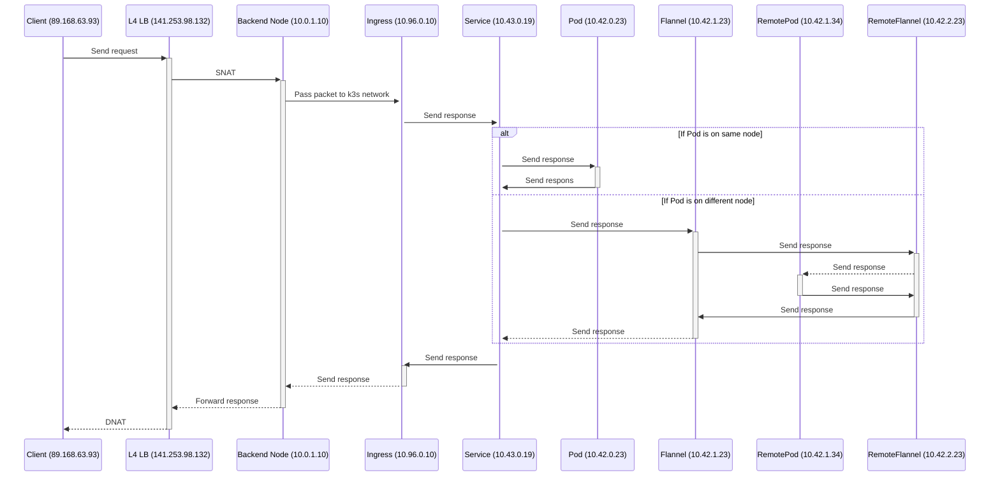
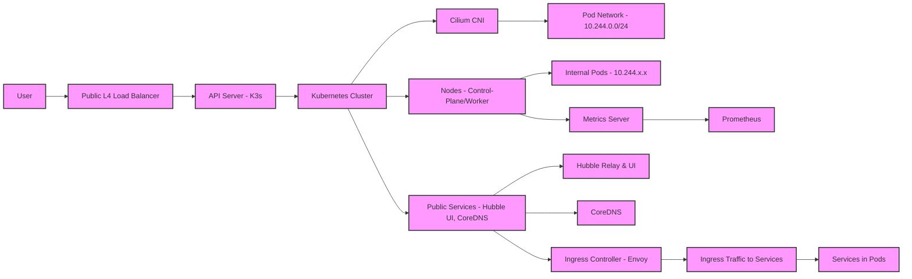

# Issue
https://github.com/tailscale/tailscale/issues/13863

sudo iptables-restore < /etc/iptables/rules.v4

# Install k3s
## Simple
We can install a kube cluster with only one server that run the controle plan and containerd worklowd

curl -sfL https://get.k3s.io | sh -s - server \
    --tls-san=<LB_IP>

curl -sfL https://get.k3s.io | K3S_TOKEN=<SECRET> sh -s - agent \
    --server https://<IP_OR_DNS_SERVER1>:6443 \
    --tls-san=<LB_IP>

## HA cluster Embedded etcd
For the clean install : 

curl -sfL https://get.k3s.io | sh -s - server \
    --cluster-init \
    --tls-san=<LB_IP> \
    --flannel-backend=none \
    --disable-network-policy  \
    --disable-kube-proxy \
    --disable servicelb \
    --disable traefik

    (--etcd-s3 \
    --etcd-s3-endpoint=<S3-BUCKET-NAME> \
    --etcd-s3-bucket=<S3-BUCKET-NAME> \
    --etcd-s3-access-key=<S3-ACCESS-KEY> \
    --etcd-s3-secret-key=<S3-SECRET-KEY>)

curl -sfL https://get.k3s.io | K3S_TOKEN=<SECRET> sh -s - server \
    --server https://<IP_OR_DNS_SERVER1>:6443 \
    --flannel-backend=none \
    --disable-network-policy  \
    --disable-kube-proxy \
    --disable servicelb \
    --disable traefik

Add this commands if you want to restore etcd database from S3 file : 
  --cluster-reset \
  --cluster-reset-restore-path=<PATH-TO-SNAPSHOT>

sudo cat /var/lib/rancher/k3s/server/token

sudo cat /etc/rancher/k3s/k3s.yaml

mkdir -p $HOME/.kube && cd $HOME/.kube
vi config
kubectl config use default
kubectl config get-contexts

mkdir $HOME/snapchot

sudo k3s etcd-snapshot save --etcd-snapshot-dir $HOME

k3s etcd-snapshot save \
  --s3 \
  --s3-bucket=<S3-BUCKET-NAME> \
  --etcd-s3-endpoint=<S3-BUCKET-ENDPOINT>
  --s3-access-key=<S3-ACCESS-KEY> \
  --s3-secret-key=<S3-SECRET-KEY>

sudo bash -c '{
  ip link delete cilium_host 2>/dev/null;
  ip link delete cilium_net 2>/dev/null;
  ip link delete cilium_vxlan 2>/dev/null;
  iptables-save | grep -iv cilium | iptables-restore;
  ip6tables-save | grep -iv cilium | ip6tables-restore;
}'

https://web.archive.org/web/20240726111518/https://prog.world/is-storage-speed-suitable-for-etcd-ask-fio/
sudo apt install -y fio
fio --rw=write --ioengine=sync --fdatasync=1 --size=22m --bs=2300 --name etcd
99.00th should be under 10 000 (10 ms)

# Install commen helm charts

# Scale up default services 

kubectl patch svc traefik -n kube-system -p '{"spec": {"externalTrafficPolicy": "Local"}}'
kubectl scale deployments.apps -n kube-system coredns --replicas=<NODE_NUMBER>
kubectl scale deployments.apps -n kube-system traefik --replicas=<NODE_NUMBER>

helm list --all-namespaces

mkdir -p ~/.kube && sudo cp /etc/rancher/k3s/k3s.yaml ~/.kube/config && sudo chown $(id -u):$(id -g) ~/.kube/config
export KUBECONFIG=~/.kube/config

## Cilium
helm upgrade --install cilium cilium \
  --repo https://helm.cilium.io \
  --version 1.17.2 \
  --namespace kube-system \
  --set operator.replicas=1 \
  --set hubble.relay.enabled=true \
  --set hubble.relay.replicas=1 \
  --set hubble.ui.enabled=true \
  --set k8sServiceHost=10.0.1.158 \
  --set k8sServicePort=6443 \
  --set kubeProxyReplacement=true \
  --set-string ipam.operator.clusterPoolIPv4PodCIDRList="10.244.0.0/16"

kubectl port-forward -n kube-system svc/hubble-ui 12000:80

## Kubernetes Dashboard
helm upgrade --install kubernetes-dashboard kubernetes-dashboard \
  --repo https://kubernetes.github.io/dashboard \
  --version 7.11.1 \
  --create-namespace --namespace kubernetes-dashboard

https://github.com/kubernetes/dashboard/blob/master/docs/user/access-control/creating-sample-user.md

kubectl -n kubernetes-dashboard port-forward svc/kubernetes-dashboard-kong-proxy 8443:443

## Cert manager
helm upgrade --install cert-manager cert-manager \
  --repo https://charts.jetstack.io \
  --version v1.17.1 \
  --namespace cert-manager \
  --create-namespace \
  --set crds.enabled=true

helm upgrade --install ingress-nginx ingress-nginx \
  --repo https://kubernetes.github.io/ingress-nginx \
  --version 4.12.1 \
  --namespace ingress-nginx \
  --create-namespace

helm upgrade --install opentelemetry-operator opentelemetry-operator \
  --repo https://open-telemetry.github.io/opentelemetry-helm-charts \
  --version "0.39.1" 
  \
    -f infrastructure/kubernetes/helm/opentelemetry-operator/values.yaml

k3s server --cluster-reset

cmctl check api --wait=2m

# Install Prometheus to scrape kubernetes engine metrics, install also Grafana with build-in dashboard
helm install prometheus prometheus-community/kube-prometheus-stack --version "51.2.0" \
    -f infrastructure/kubernetes/helm/kube-prometheus-stack/values.yaml \
    --namespace=dev

# Create postgres exporter to be able to monitor with prometheus
helm install postgres-exporter prometheus-community/prometheus-postgres-exporter --version "5.1.0" \
    -f infrastructure/kubernetes/helm/prometheus-postgres-exporter/values.yaml \
    --namespace=dev

# Install the opentelemetry Operator, this automatically generate a self-signed cert and a secret for the webhook
helm install my-opentelemetry-operator open-telemetry/opentelemetry-operator --version "0.39.1" \
    -f infrastructure/kubernetes/helm/opentelemetry-operator/values.yaml

default via 10.0.1.1 dev enp0s6 proto dhcp src 10.0.1.158 metric 100 
default via 10.0.1.1 dev enp0s6 proto dhcp src 10.0.1.158 metric 1002 mtu 9000 
10.0.1.0/24 dev enp0s6 proto dhcp scope link src 10.0.1.158 metric 1002 mtu 9000 
10.0.1.1 dev enp0s6 proto dhcp scope link src 10.0.1.158 metric 100 
169.254.0.0/16 dev enp0s6 proto dhcp scope link src 10.0.1.158 metric 100 
169.254.0.0/16 dev enp0s6 proto dhcp scope link src 10.0.1.158 metric 1002 mtu 9000 
169.254.169.254 dev enp0s6 proto dhcp scope link src 10.0.1.158 metric 100 

