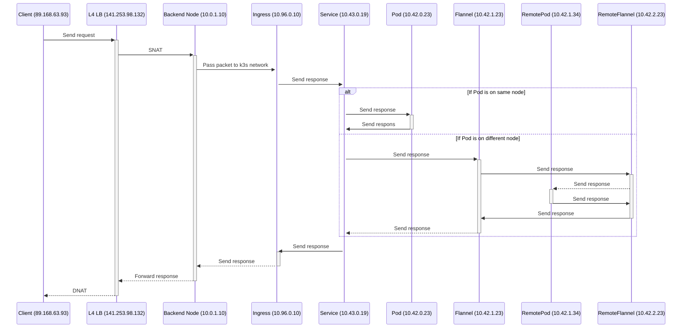
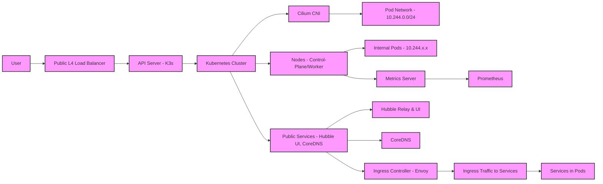

# Install k3s

## HA cluster Embedded etcd
```sh
curl -sfL https://get.k3s.io | sh -s - server \
    --cluster-init \
    --tls-san=<LB_IP> \
    --flannel-backend=none \
    --disable-network-policy  \
    --disable-cloud-controller \
    --disable=servicelb \
    --disable=traefik \
    --etcd-expose-metrics \
    --kube-controller-manager-arg="cloud-provider=external" \
    --kubelet-arg="cloud-provider=external" \
    --kubelet-arg="provider-id=<INSTANCE_ID>" \
    --kube-scheduler-arg="bind-address=0.0.0.0"	\
    --kube-controller-manager-arg="bind-address=0.0.0.0" \
    --kube-proxy-arg="metrics-bind-address=0.0.0.0" \
    --etcd-s3 \
    --etcd-s3-config-secret=k3s-etcd-snapshot-s3-config

    # Token for adding other node to the cluster
    sudo cat /var/lib/rancher/k3s/server/token
    # File for connecting to the cluster
    sudo cat /etc/rancher/k3s/k3s.yaml
    # Make ubuntu user able to connect to cluster
    mkdir -p ~/.kube && sudo cp /etc/rancher/k3s/k3s.yaml ~/.kube/config && sudo chown $(id -u):$(id -g) ~/.kube/config
    export KUBECONFIG=~/.kube/config

    # Set S3 auth info for automated backups
    kubectl apply -f k3s-etcd-snapshot-s3-config
```

```sh
curl -sfL https://get.k3s.io | K3S_TOKEN=<SECRET> sh -s - server \
    --server https://<IP_OR_DNS_SERVER1>:6443 \
    --flannel-backend=none \
    --disable-network-policy  \
    --disable-cloud-controller \
    --disable=servicelb \
    --disable=traefik \
    --etcd-expose-metrics \
    --kube-controller-manager-arg="cloud-provider=external" \
    --kubelet-arg="cloud-provider=external" \
    --kubelet-arg="provider-id=<INSTANCE_ID>" \
    --kube-scheduler-arg="bind-address=0.0.0.0"	\
    --kube-controller-manager-arg="bind-address=0.0.0.0" \
    --kube-proxy-arg="metrics-bind-address=0.0.0.0" \
    --etcd-s3 \
    --etcd-s3-config-secret=k3s-etcd-snapshot-s3-config
```

# Unistall server node

sudo ip link delete cilium_host 
sudo ip link delete cilium_net 
sudo ip link delete cilium_vxlan 
sudo iptables-save | grep -iv cilium | sudo iptables-restore 
sudo ip6tables-save | grep -iv cilium | sudo ip6tables-restore 
/usr/local/bin/k3s-uninstall.sh


https://web.archive.org/web/20240726111518/https://prog.world/is-storage-speed-suitable-for-etcd-ask-fio/
sudo apt install -y fio
fio --rw=write --ioengine=sync --fdatasync=1 --size=22m --bs=2300 --name etcd
99.00th should be under 10 000 (10 ms)

# Install commen helm charts

# Scale up default services 

kubectl patch svc traefik -n kube-system -p '{"spec": {"externalTrafficPolicy": "Local"}}'
kubectl scale deployments.apps -n kube-system coredns --replicas=<NODE_NUMBER>
kubectl scale deployments.apps -n kube-system traefik --replicas=<NODE_NUMBER>

helm list --all-namespaces


## Cilium
helm upgrade --install cilium cilium \
  --repo https://helm.cilium.io \
  --version 1.17.2 \
  --namespace kube-system \
  --set operator.replicas=1 \
  --set hubble.relay.enabled=true \
  --set hubble.relay.replicas=1 \
  --set hubble.ui.enabled=true \
  --set hubble.metrics.enabled="{dns:query;ignoreAAAA,drop,tcp,flow,icmp,http}" \
  --set-string ipam.operator.clusterPoolIPv4PodCIDRList="10.244.0.0/16" \
  --set ipam.operator.clusterPoolIPv4MaskSize=24 \
  --set prometheus.enabled=true \
  --set operator.prometheus.enabled=true

kubectl port-forward -n kube-system svc/hubble-ui 12000:80


## Kubernetes Dashboard
helm upgrade --install kubernetes-dashboard kubernetes-dashboard \
  --repo https://kubernetes.github.io/dashboard \
  --version 7.11.1 \
  --create-namespace \
  --namespace monitoring
  
https://github.com/kubernetes/dashboard/blob/master/docs/user/access-control/creating-sample-user.md

kubectl -n kubernetes-dashboard port-forward svc/kubernetes-dashboard-kong-proxy 8443:443

## Cert manager
helm repo add https://charts.jetstack.io
helm repo update
helm upgrade --install cert-manager cert-manager \
  --version v1.17.1 \
  --namespace cert-manager \
  --create-namespace \
  --set crds.enabled=true


# Opentelemetry
helm repo add https://open-telemetry.github.io/opentelemetry-helm-charts
helm repo update
helm upgrade --install opentelemetry-operator opentelemetry-operator \
  --version "0.39.1" \
  --namespace monitoring
  -f infrastructure/kubernetes/helm/opentelemetry-operator/values.yaml


# Storage Class
https://github.com/oracle/oci-cloud-controller-manager/blob/bb196921c90762354c5bd7d6fe1c137820af7197/container-storage-interface.md

change oci-csi-controller-driver.yaml:
modify : node-role.kubernetes.io/control-plane: "" to node-role.kubernetes.io/control-plane: "true"

https://github.com/oracle/oci-cloud-controller-manager/pull/477/files

pec.nodeAffinity.required.nodeSelectorTerms[1].matchExpressions[0].key: failure-domain.beta.kubernetes.io/zone is deprecated since v1.17; use "topology.kubernetes.io/zone" instead

only topology.kubernetes.io/zone

kubectl  create secret generic oci-volume-provisioner \
  -n kube-system \
  --from-file=config.yaml=cloud-provider-example.yaml

To remove PV (https://github.com/kubernetes-csi/external-provisioner/issues/1217): 
kubectl patch pv <CSI_NAME> -p '{"metadata":{"finalizers":null}}'

## Change the default cluster className : 

kubectl patch storageclass local-path -p '{"metadata": {"annotations": {"storageclass.kubernetes.io/is-default-class": "false"}}}'
kubectl patch storageclass oci-bv -p '{"metadata": {"annotations": {"storageclass.kubernetes.io/is-default-class": "true"}}}'

# Install Prometheus to scrape kubernetes engine metrics, install also Grafana with build-in dashboard
```sh
helm repo add https://prometheus-community.github.io/helm-charts
helm repo update
helm install prometheus prometheus-community/kube-prometheus-stack \
  --version 70.4.2 \
  --namespace=monitoring \
  --create-namespace \
  -f ../../kubernetes/helm/kube-prometheus-stack/values.yaml

helm upgrade prometheus prometheus-community/kube-prometheus-stack -n monitoring \
  --version 70.4.2 \
  -f ../../kubernetes/helm/kube-prometheus-stack/values.yaml

kubectl port-forward svc/prometheus-operated -n monitoring 9090:9090
```

# Tempo 
helm repo add repo https://grafana.github.io/helm-charts
helm repo update
helm upgrade --install grafana grafana/tempo-distributed \
  --version 1.35.0 \
  --namespace monitoring

# PG Operator
helm repo add cnpg https://cloudnative-pg.github.io/charts
helm repo update
helm upgrade --install cnpg  cnpg/cloudnative-pg \
  --version 0.23.2 \
  --namespace cnpg-system \
  --create-namespace
 
  


# Create postgres exporter to be able to monitor with prometheus
helm install postgres-exporter prometheus-community/prometheus-postgres-exporter --version "5.1.0" \
    -f infrastructure/kubernetes/helm/prometheus-postgres-exporter/values.yaml \
    --namespace=dev

# Install the opentelemetry Operator, this automatically generate a self-signed cert and a secret for the webhook
helm install my-opentelemetry-operator open-telemetry/opentelemetry-operator --version "0.39.1" \
    -f infrastructure/kubernetes/helm/opentelemetry-operator/values.yaml





